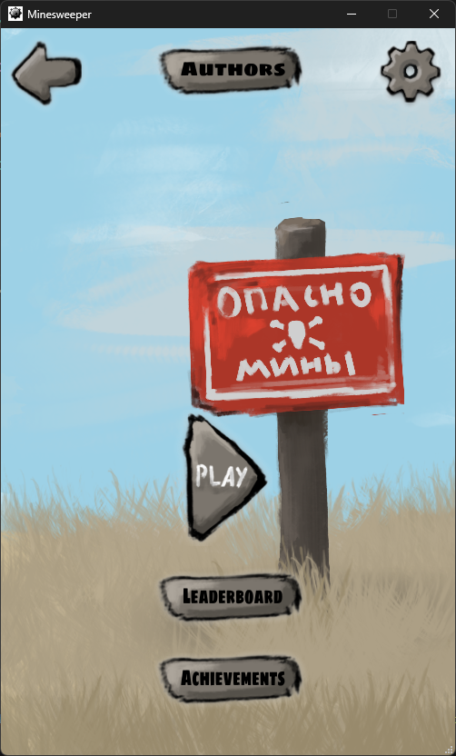
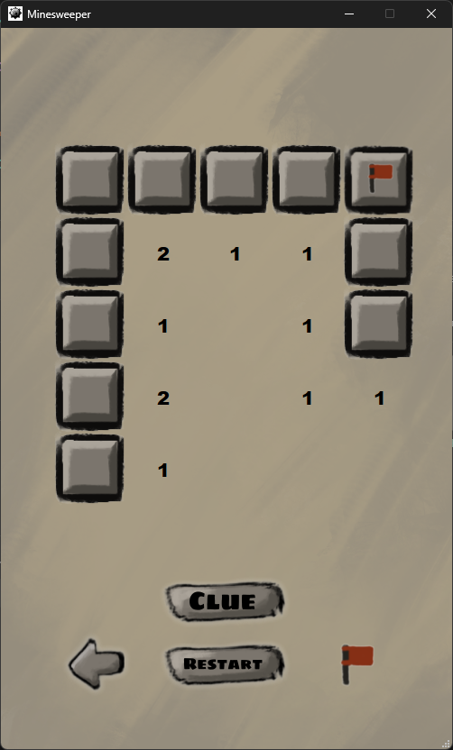
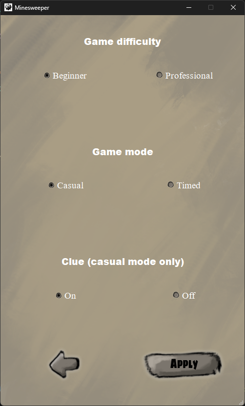
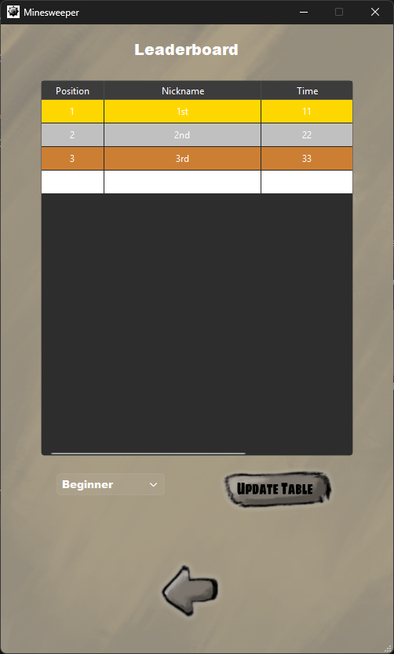
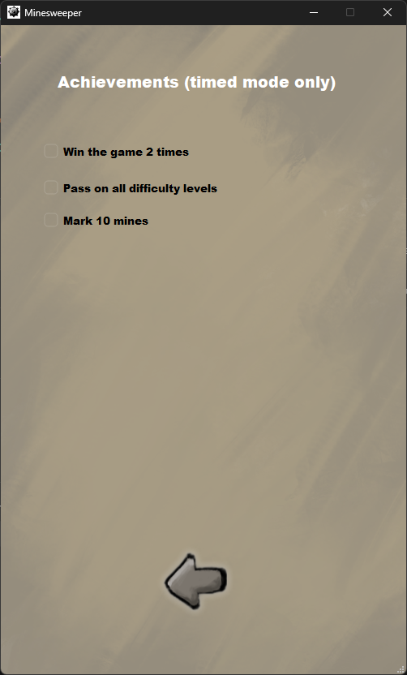
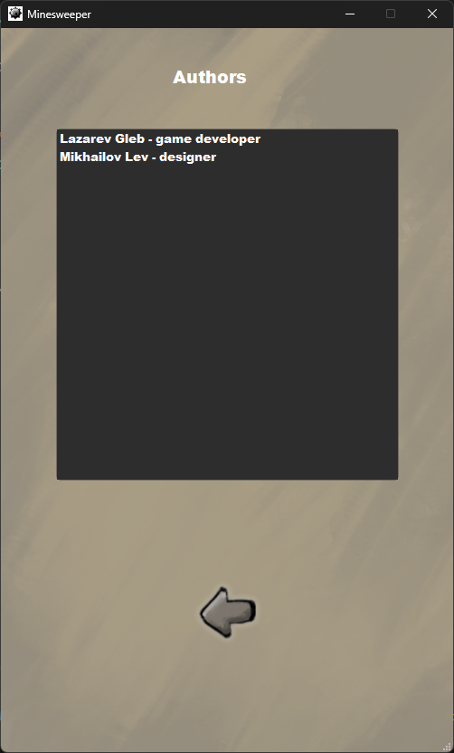

# 💥 Minesweeper

Классическая игра «Сапер» с немного расширенным функционалом. Проект реализован на Python и ориентирован на ОС Windows

## Стек технологий
*  **python 3.12**
*  **pyqt6** (6.11) — графический интерфейс *(полный список зависимостей в `requirements.txt`)*
*  **pyInstaller** — сборка проекта в standalone-приложение


## Статистика
* 1000+ строчек SLOC python кода (без учета пробелов и конфигурационных файлов)
* 450+ строчек комментариев в коде


## 🚀 Установка и запуск
**Вариант 1: Из исходного кода**
```bash
pip install -r requirements.txt
python main.py
```
**Вариант 2: Готовый билд**
Скачайте архив из раздела releases, распакуйте и запустите `Minesweeper/minesweeper.exe`.


## Архитектура и структура кода
Игра реализована с четким разделением на визуал (frontend) и логику (backend) 
* Используется множественное наследование. Окна получают общий интерфейс от `BasicWindowInterface` (стилизация, фон, иконки) и базовую логику от `BasicWindowFunctionality` (навигация, управление окном, связка сигналов и тп). При инициализации учитывается состояние предыдущего окна
* Каждый раздел игры (Menu, Game, Settings, Achievements, Authors, Leaderboard) состоит из трех файлов:
  * `.ui` — XML-разметка интерфейса
  * `.py` (Frontend) — визуальная часть
  * `.py` (Backend) — логика раздела
* Ключевые сущности вынесены в dataclass'ы, а конфигурация и персистентные данные хранятся в отдельных файлах:
  * `data.json` — системные настройки и пути к файлам (размеры окон, условия достижений)
  * `authors.txt` — информация о создателях
  * `achievements.csv` — локальный прогресс игрока
   * `storage.sqlite` — локальная база данных результатов

## Скриншоты

<table><tr><td align="center"><b>Главное меню</b><br></td><td align="center"><b>Игровой процесс</b><br></td></tr><tr><td align="center"><b>Настройки</b><br></td><td align="center"><b>Таблица лидеров</b><br></td></tr><tr><td align="center"><b>Достижения</b><br></td><td align="center"><b>Авторы</b><br></td></tr></table>

## Геймплей и механики
* Есть несколько **режимов игры**: "Классический" и "На время" (только в нем доступен учет в таблице лидеров). В режиме на время подсказки отключаются автоматически
* **Уровни сложности:** 
  * *Beginner* — поле 5x5, 4 мины
  * *Professional* — поле 10x10, 16 мин
* **Первый клик** всегда безопасен (мины генерируются после открытия первой ячейки)
* Имеются **подсказки** - опциональная функция, показывающая расположение мин (доступна только в классическом режиме, если включена в настройках)
* Наличие **системы достижений**, включающей 3 уникальных ачивки (2 победы, прохождение всех урвоней сложностей, корректная установка 10 флагов)
* Присутствует локальный **рейтинг**, сегментированный по уровню сложности

## Планы
- [ ] Добавление глобальной онлайн-таблицы лидеров
- [ ] Пользовательская настройка сложности (кастомный размер поля и количество мин)
- [ ] Исправить баг с надписью "Timer" в самой игре
- [ ] Добавить логирование
